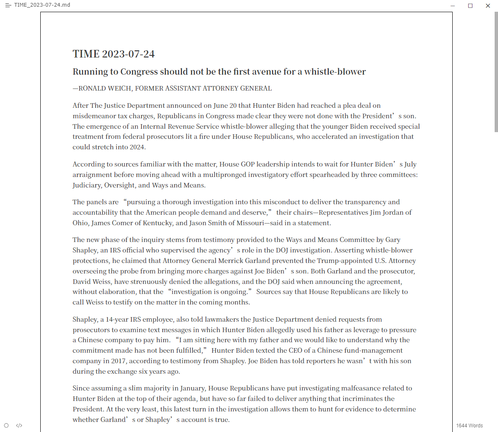
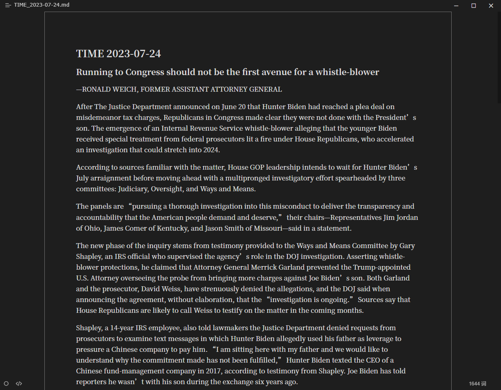
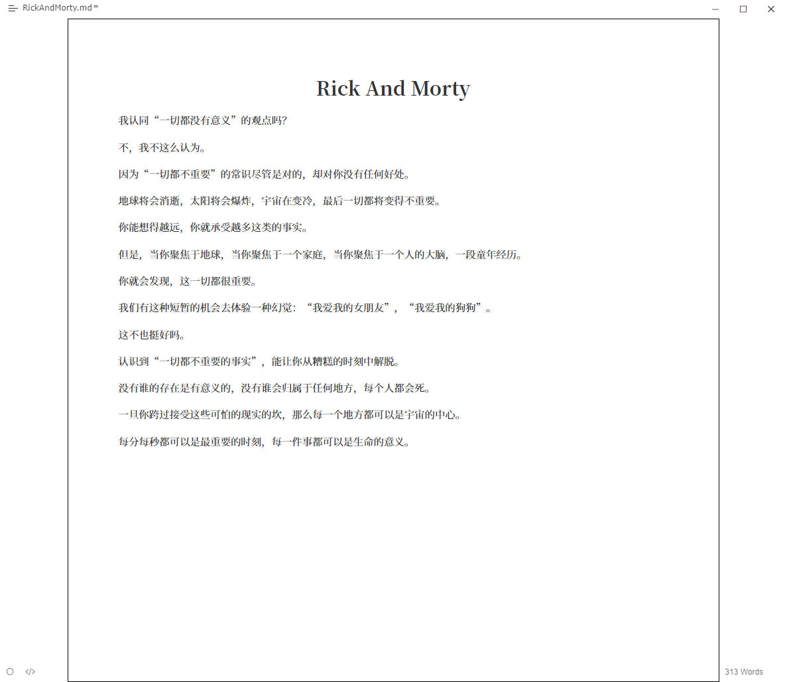
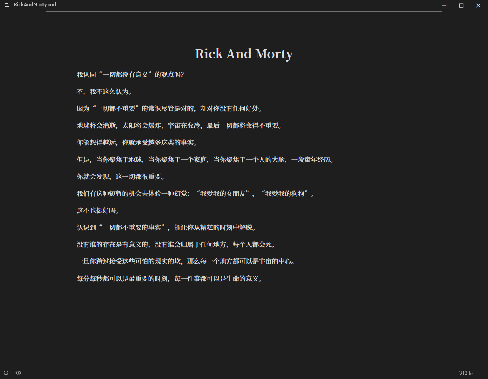
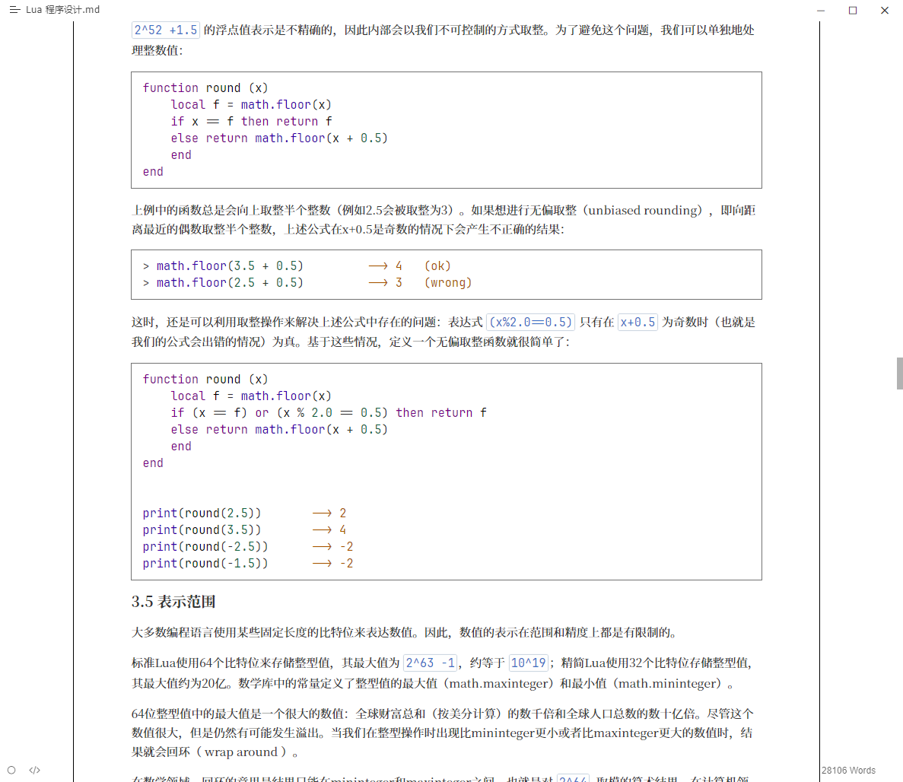
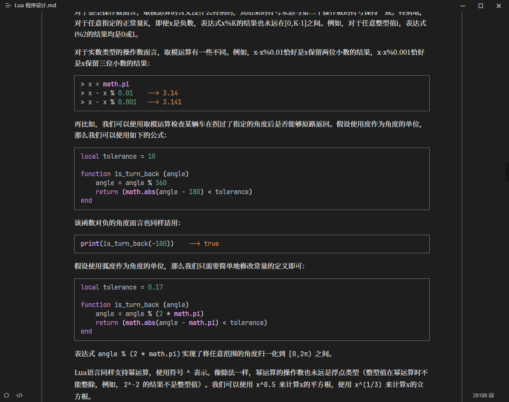
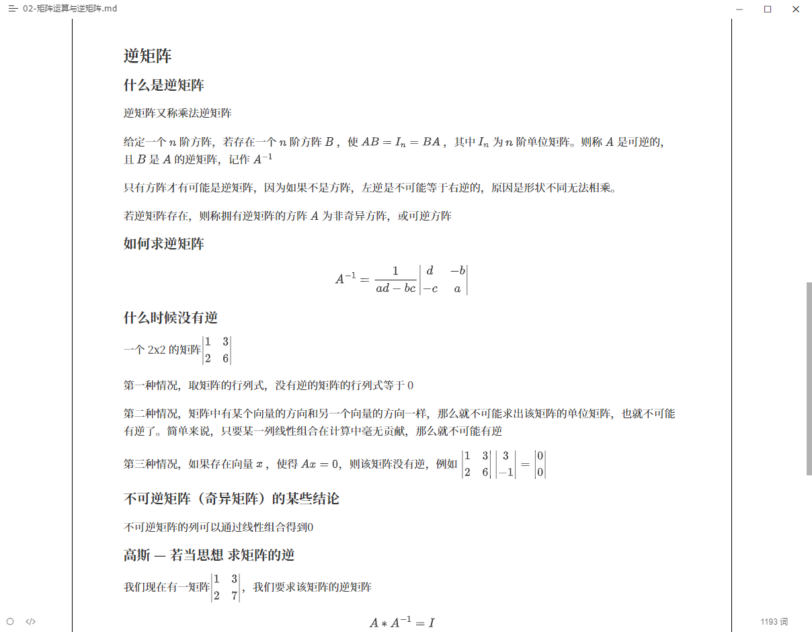
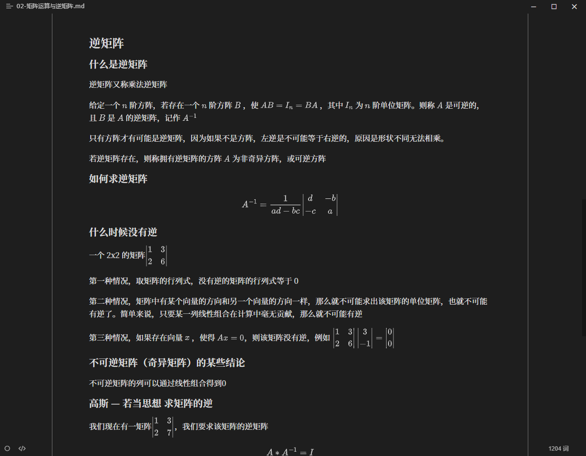
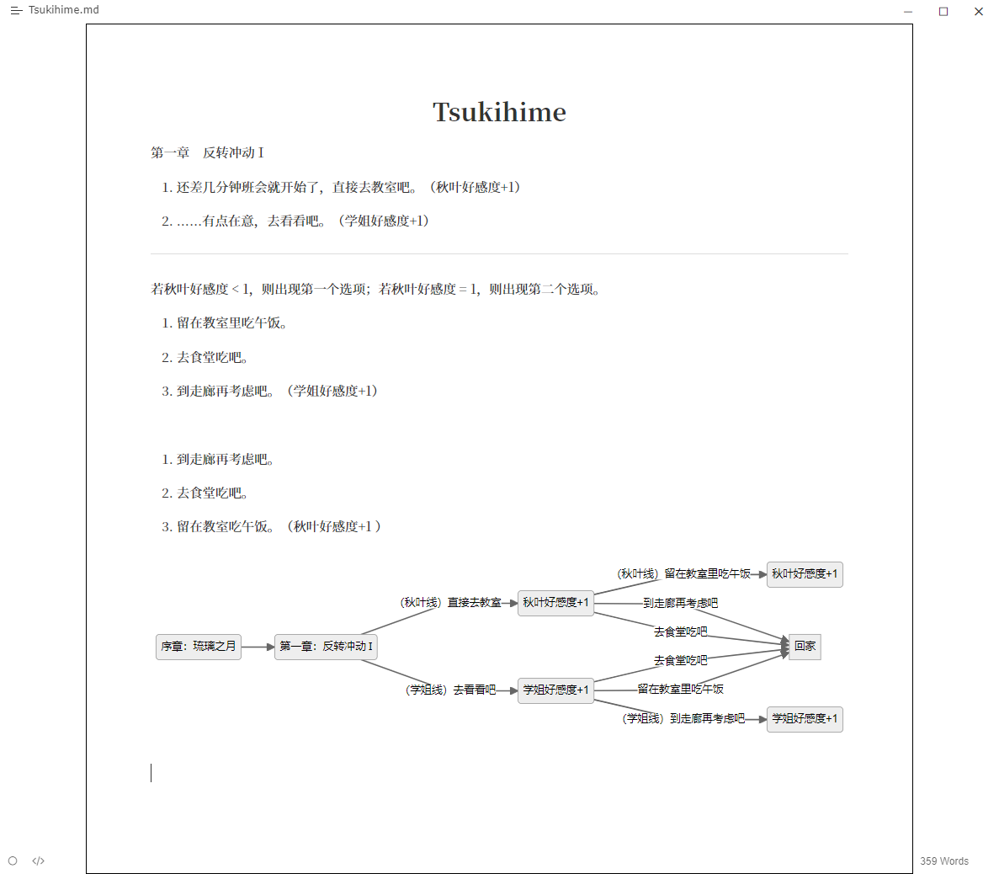

<div align=center>
    
</div>

# Novel Tex

> Novel Tex 是基于 [typora-latex-theme](https://github.com/Keldos-Li/typora-latex-theme) 的修改版本，沿用 GPL 3.0 许可证。

主要修改：

1. 移除了 typora-latex-theme 的标题自动编号特性
2. 修改了 typora-latex-theme 的页面大小与字体大小，优化了笔记本设备的使用体验
3. 将 mermaid 的默认主题修改为灰色，使其与主题风格更加统一
4. 增加了代码块线框，使代码块在文档中更加显眼
5. 更改了默认字体

NovelTex 使用思源黑体作为文档中文字体、Arial 作为文档英文字体、微软雅黑作为 UI 字体、Consolas 作为代码字体

思源黑体：https://github.com/adobe-fonts/source-han-sans/releases/download/2.004R/SourceHanSansSC.zip

## 开发指南

所有基础性的配置全部放入`novel-tex/basic/`中，所有与明暗配置相关的内容放入`dark/`与`light/`中，放在根目录的主题文件只用于修改颜色变量。

```shell
theme/
├─novel-tex/
│   ├─basic/
│   ├─dark/
│   └─light/
├─novel-tex-f-d.css
├─novel-tex-f-l.css
├─novel-tex-n-d.css
└─novel-tex-n-l.css
```

**Screenshots**

















